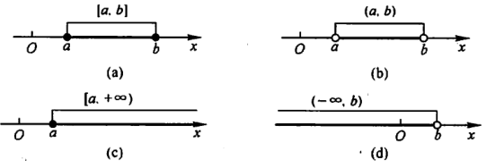

# 高等数学

[TOC]

## 函数与极限

### 集合

#### 常见集合

自然数集合
$$
N=\left\{0,1,2,\cdots,n,\cdots\right\}\tag{0}
$$
正整数集合
$$
N^*=\left\{1,2,3,\cdots,n,\cdots\right\}\tag{1}
$$

#### 集合运算

集合的基本运算：交、并、差 
$$
A\cup B=\left\{x|x\in A或x\in B\right\}\\
A\cap B=\left\{x|x\in A且x\in B\right\}\\
A\setminus B=\left\{x|x\in A且A\notin B\right\}\\
$$
这些运算满足下列法则

1. 交换律
   $$
   A\cup B=B\cup A\\
   A\cap B=B\cap A
   $$

2. 结合律
   $$
   (A\cup B)\cup C=A\cup (B\cup C)\\
   (A\cap B)\cap C=A\cap (B\cap C)\\
   $$

3. 分配律
   $$
   (A\cup B)\cap C=(A\cap C)\cup(B\cap C)\\
   (A\cap B)\cup C=(A\cup C)\cap(B\cup C)
   $$

4. 对偶律
   $$
   (A\cup B)^c=A^c\cap B^c\\
   (A\cap B)^c=A^c\cup B^c
   $$

#### 区间和邻域

1. 区间

   1. 开区间

   2. 闭区间

   3. 半开区间

      

2. 邻域

   1. 以a为中心的的任何开区间，为a的邻域，记作U(a)
   2. 以a为中心, 以b为半径的任何开区间，为a的b邻域，记作U(a, b)
   3. 在2的基础上，去掉a点的区域，叫做a的去心b领域

### 映射

#### 概念

原像、像、定义域、值域